<div align="center">

[English](README.md) | **简体中文**

<!-- Octo animated banner (SMIL animation, works on GitHub) -->


<h1>KnowledgePulse</h1>
<p><strong>开放式 AI 知识共享协议 &mdash; SKILL.md 兼容</strong></p>

<!-- 徽章 -->


<a href="https://openknowledgepulse.org"><strong>官网</strong></a> · <a href="https://openknowledgepulse.org/zh-Hans/docs/getting-started/introduction"><strong>文档</strong></a> · <a href="https://github.com/chesterkuo/OpenKnowledgePulse"><strong>GitHub</strong></a>

</div>

---

KnowledgePulse 让 AI 智能体和人类专家能够跨框架、跨组织地共享问题解决经验——推理链、工具调用模式和标准操作流程——同时保护数据隐私和知识产权。

基于**双层架构**构建：

- **第一层** -- 完全兼容现有 SKILL.md 开放标准（SkillsMP 200,000+ 技能）
- **第二层** -- 动态知识层，智能体执行经验自动转化为可共享、可验证、有激励的 KnowledgeUnit

> 可以将其理解为 **AI 智能体的特斯拉车队学习**：一个智能体发现了某种金融分析技术，它将自动成为整个生态系统的共享资产。

## 功能特性

| 模块 | 说明 |
|------|------|
| **技能注册中心** | 语义 + BM25 混合搜索，一键安装到 `~/.claude/skills/` |
| **知识捕获** | 从智能体执行过程中自动提取推理链（零配置） |
| **知识检索** | 语义搜索 + few-shot 注入 API |
| **专家 SOP 工作室** | 可视化决策树编辑器 |
| **知识市场** | 免费 / 组织内 / 订阅 / 按次付费的知识交换 |
| **KP-REP 声誉** | 灵魂绑定声誉系统，支持可验证凭证（Ed25519） |

## 快速开始

### 安装

```bash
# CLI 工具
bun add -g @knowledgepulse/cli

# TypeScript SDK
bun add @knowledgepulse/sdk

# MCP 服务器
bun add @knowledgepulse/mcp
```

### 搜索和安装技能

```bash
# 搜索技能
kp search "financial analysis"

# 安装技能（自动生成 SKILL.md 到 ~/.claude/skills/）
kp install financial-report-analyzer

# 验证 SKILL.md 格式
kp validate ./my-skill.md
```

### 启用知识捕获（TypeScript）

```typescript
import { KPCapture } from "@knowledgepulse/sdk";

const capture = new KPCapture({
  domain: "financial_analysis",
  visibility: "network",
  valueThreshold: 0.75,
});

// 包装你的现有智能体——知识将自动共享
const wrappedAgent = capture.wrap(yourExistingAgentFn);
const result = await wrappedAgent("分析台积电 2025 Q4 财报");
```

### Python 框架通过 MCP 接入（无需 Python SDK）

```python
# LangGraph / CrewAI / AutoGen 通过 MCP HTTP 访问 KnowledgePulse
mcp_config = {
    "knowledgepulse": {
        "url": "https://registry.knowledgepulse.dev/mcp",
        "transport": "http"
    }
}

# 智能体可以直接调用 KP MCP 工具
result = agent.run(
    "分析财报",
    tools=["kp_search_skill", "kp_search_knowledge"]
)
```

### 自托管注册中心

```bash
git clone https://github.com/chesterkuo/OpenKnowledgePulse
cd knowledgepulse
bun install
bun run registry/src/index.ts
# Registry API: http://localhost:8080
```

## 架构

```
+-------------------------------------------------------------------+
|                    KnowledgePulse 协议栈                            |
+-------------------------------------------------------------------+
|  第五层：治理与激励                                                  |
|           KP-REP 声誉 SBT · 质量验证                               |
+-------------------------------------------------------------------+
|  第四层：隐私与安全                                                  |
|           聚合共享 · 差分隐私 · 访问控制                              |
+-------------------------------------------------------------------+
|  第三层：发现与交换                                                  |
|           知识注册中心 · MCP 服务器 · REST API                       |
+-------------------------------------------------------------------+
|  第二层：KnowledgeUnit 层  <-- 核心差异化                            |
|           ReasoningTrace · ToolCallPattern · ExpertSOP              |
+-------------------------------------------------------------------+
|  第一层：SKILL.md 兼容层  <-- 现有生态                               |
|           SkillsMP / SkillHub / Smithery / Claude Code / Codex      |
+-------------------------------------------------------------------+
```

## 仓库结构

```
knowledgepulse/
  packages/
    sdk/           @knowledgepulse/sdk    -- 类型、捕获、检索、评分
    mcp-server/    @knowledgepulse/mcp    -- 6 个 MCP 工具，双模桥接
    cli/           @knowledgepulse/cli    -- 搜索、安装、验证、贡献
    sop-studio/    SOP Studio React SPA   -- 可视化决策树编辑器
  registry/        Hono REST API 服务器    -- 认证、限流、SQLite/内存存储
  specs/           JSON Schema、代码生成、SKILL.md 扩展规范
  examples/        SDK 用法、MCP 客户端、LangGraph 集成
  website/         Docusaurus 3 文档站     -- 双语（en + zh-Hans）
```

## 技术栈

| 组件 | 技术 |
|------|------|
| 运行时 | Bun |
| HTTP 服务器 | Hono |
| 类型验证 | Zod + zod-to-json-schema |
| SDK 构建 | tsup（ESM + CJS + .d.ts） |
| SOP Studio | React 19 + Vite + Tailwind CSS v4 + React Flow |
| 代码检查 | Biome |
| 测试 | bun test（639 个测试） |
| 协议 | MCP（模型上下文协议） |
| 文档 | Docusaurus 3（en + zh-Hans） |

## MCP 工具

| 工具 | 说明 |
|------|------|
| `kp_search_skill` | 语义搜索 SKILL.md 注册中心 |
| `kp_get_skill` | 通过 ID 获取完整技能内容 |
| `kp_contribute_skill` | 提交新技能并自动验证 |
| `kp_search_knowledge` | 搜索 KnowledgeUnit（推理链、模式、SOP） |
| `kp_contribute_knowledge` | 贡献 KnowledgeUnit 并预评分 |
| `kp_validate_unit` | 验证 KnowledgeUnit 架构合规性 |

## KnowledgeUnit 类型

### ReasoningTrace

捕获智能体完整的问题解决链：思考、工具调用、观察和错误恢复步骤。

### ToolCallPattern

可复用的工具编排序列，包含触发条件、性能指标和成功率。

### ExpertSOP

人类专家标准操作流程转换为机器可执行的决策树，包含条件、SLA 和工具建议。

## 知识价值评分

所有贡献的知识都在本地评分（< 100ms，无需外部 LLM），使用 4 维模型：

| 维度 | 权重 | 衡量内容 |
|------|------|----------|
| 复杂性 | 0.25 | 步骤类型多样性、错误恢复、分支 |
| 新颖性 | 0.35 | 与本地嵌入缓存的余弦距离 |
| 工具多样性 | 0.15 | 相对于步骤数的独特 MCP 工具数 |
| 结果置信度 | 0.25 | 成功率 + 置信度分数 |

## 框架集成

| 框架 | 集成方式 | 优先级 |
|------|----------|--------|
| Claude Code | 原生 SKILL.md | P0 |
| OpenAI Codex CLI | 原生 SKILL.md | P0 |
| OpenClaw | TypeScript SDK | P0 |
| LangGraph | MCP HTTP | P1 |
| CrewAI | MCP HTTP | P1 |
| AutoGen | MCP HTTP | P1 |
| Flowise | TypeScript 插件 | P2 |

## 开发

```bash
# 安装依赖
bun install

# 运行所有测试
bun test --recursive

# 构建 SDK
cd packages/sdk && bun run build

# 启动注册中心
bun run registry/src/index.ts

# 启动 SOP Studio
cd packages/sop-studio && npx vite dev

# 构建文档
cd website && npm run build
```

## 文档

完整文档提供英文和简体中文版本：

- [快速入门](https://openknowledgepulse.org/zh-Hans/docs/getting-started/introduction)
- [架构](https://openknowledgepulse.org/zh-Hans/docs/architecture/overview)
- [SDK 参考](https://openknowledgepulse.org/zh-Hans/docs/sdk/types)
- [Registry API](https://openknowledgepulse.org/zh-Hans/docs/registry/api-reference)
- [MCP 服务器](https://openknowledgepulse.org/zh-Hans/docs/mcp-server/setup)
- [CLI](https://openknowledgepulse.org/zh-Hans/docs/cli/reference)
- [SOP Studio](https://openknowledgepulse.org/zh-Hans/docs/sop-studio/getting-started)
- [知识市场](https://openknowledgepulse.org/zh-Hans/docs/marketplace/overview)

## 贡献

请参阅 [CONTRIBUTING.md](CONTRIBUTING.md) 了解贡献指南。所有贡献需要：

1. 通过测试（`bun test`）
2. 通过代码检查（`biome check`）
3. SDK 构建通过（`cd packages/sdk && bun run build`）

## 路线图

| 阶段 | 状态 | 重点 |
|------|------|------|
| 第一阶段 | 已完成 | SKILL.md 注册中心 + SDK + MCP + CLI |
| 第二阶段 | 已完成 | 知识捕获 + 评分 + 声誉 |
| 第三阶段 | 已完成 | 专家 SOP Studio + 市场 |
| 第四阶段 | 已完成 | UI 打磨 + 行业标准化 |

## 许可证

[Apache 2.0](LICENSE)

---

<div align="center">

*分享你的所学。*

</div>
